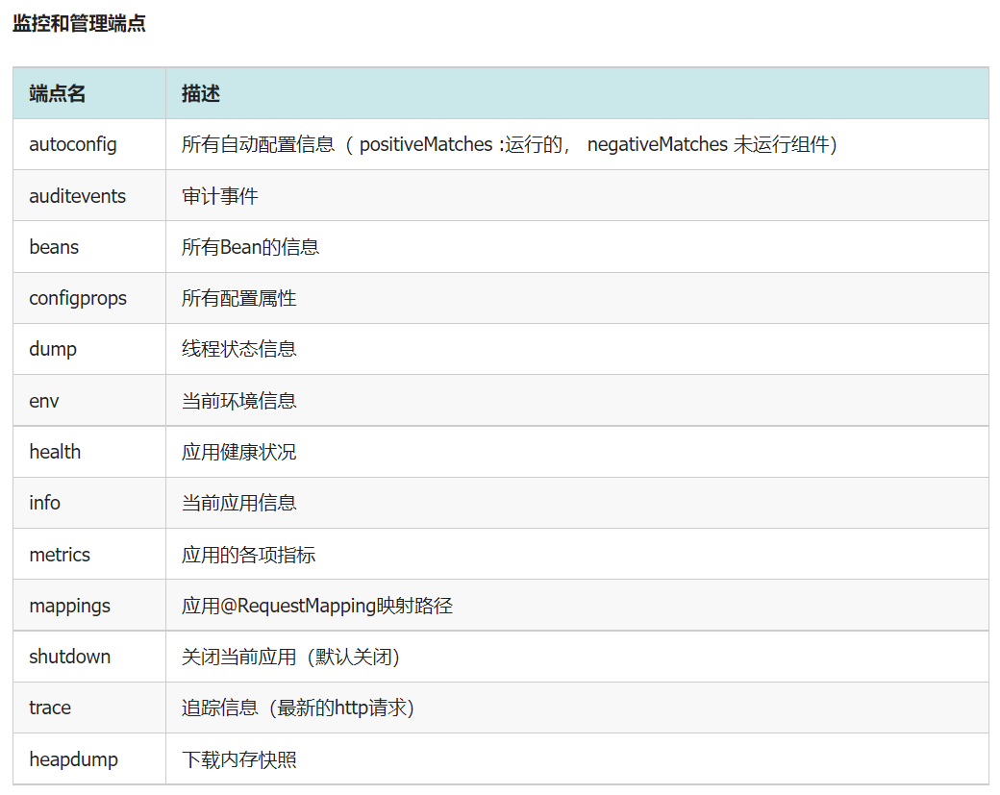

## Demo-Actuator

> 主要演示了如何在 Spring Boot 中通过 actuator 检查项目运行情况

---

### 端点暴露地址

将项目运行起来之后，会在**控制台**里查看所有可以访问的端口信息

```shell
# 看到所有的mapping信息
explorer http://localhost:8090/sys/actuator/mappings
```

```shell
# 看到所有 Spring 管理的Bean
explorer http://localhost:8090/sys/actuator/beans
```




更多可访问的路径，参见文档

---

### 参考

actuator文档

```shell
explorer https://docs.spring.io/spring-boot/docs/2.0.5.RELEASE/reference/htmlsingle/
#production-ready
```

具体可以访问哪些路径

```shell
explorer https://docs.spring.io/spring-boot/docs/2.0.5.RELEASE/reference/htmlsingle/
#production-ready-endpoints
```