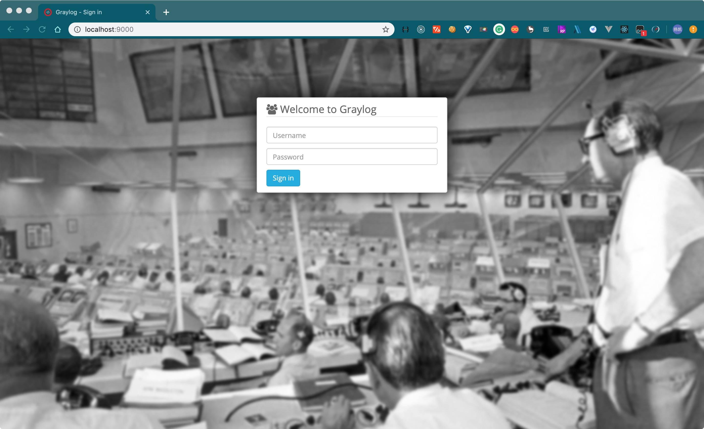
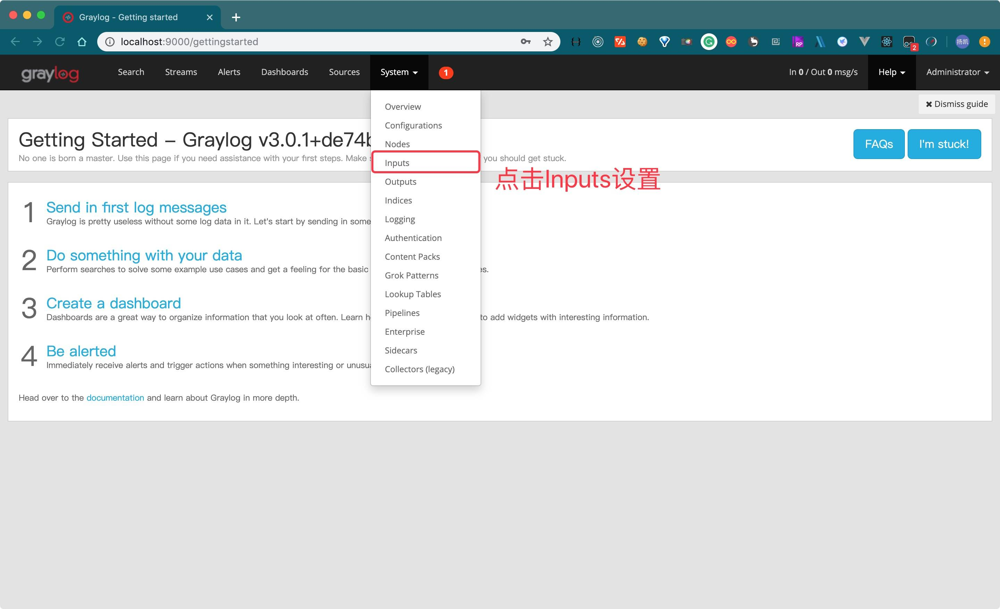
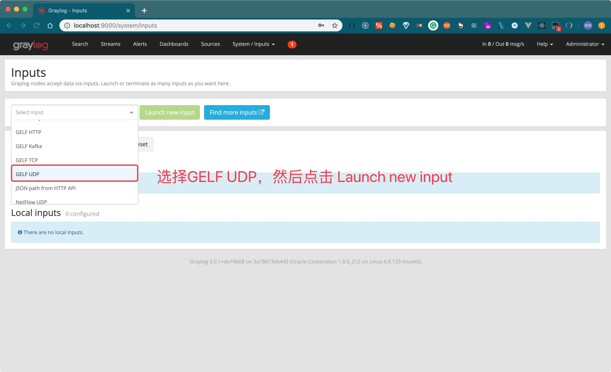
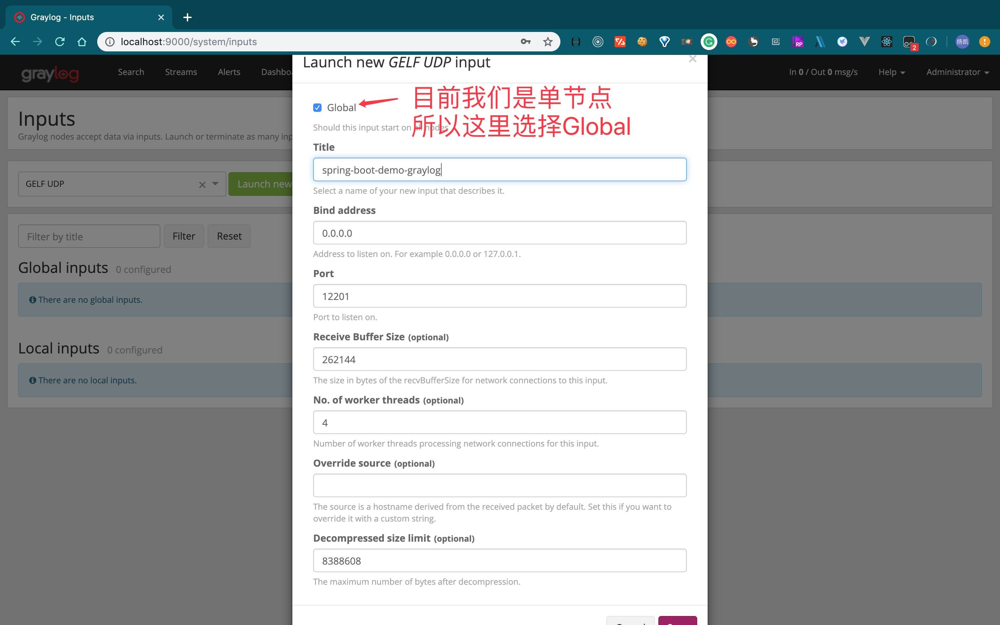
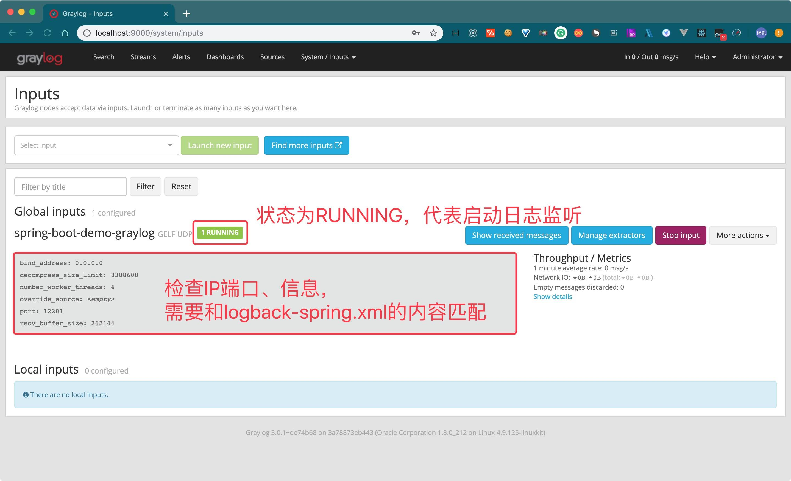
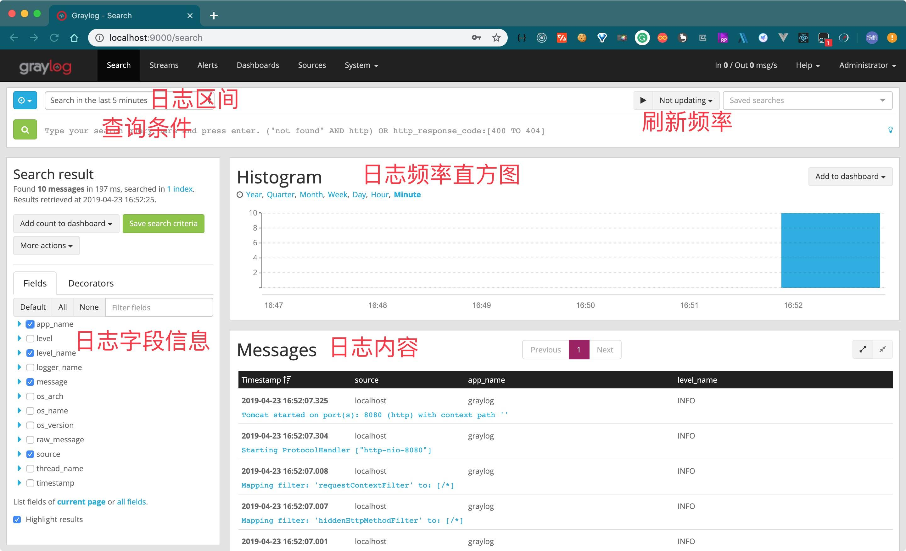

## GrayLog

> 此 Demo 主要演示了 Spring Boot 项目如何接入 GrayLog 进行日志管理

### 环境准备

**编写 `graylog` 的 `docker-compose` 启动文件**

> `graylog` 采用 `docker-compose` 启动，其中 `graylog` 依赖的 `mongodb` 以及 `elasticsearch`
> 都同步启动，生产环境建议使用外部存储。
> 如果本地没有 `mongo:3` 和 `elasticsearch-oss:6.6.1` 的镜像，会比较耗时间

```yaml
version: '2'
services:
  # MongoDB: https://hub.docker.com/_/mongo/
  mongodb:
    image: mongo:3
  # Elasticsearch: https://www.elastic.co/guide/en/elasticsearch/reference/6.6/docker.html
  elasticsearch:
    image: docker.elastic.co/elasticsearch/elasticsearch-oss:6.6.1
    environment:
      - http.host=0.0.0.0
      - transport.host=localhost
      - network.host=0.0.0.0
      - "ES_JAVA_OPTS=-Xms512m -Xmx512m"
    ulimits:
      memlock:
        soft: -1
        hard: -1
    mem_limit: 1g
  # Graylog: https://hub.docker.com/r/graylog/graylog/
  graylog:
    image: graylog/graylog:3.0
    environment:
      # 加密盐值，不设置，graylog会启动失败
      # 该字段最少需要16个字符
      - GRAYLOG_PASSWORD_SECRET=somepasswordpepper
      # 设置用户名
      - GRAYLOG_ROOT_USERNAME=admin
      # 设置密码，此为密码进过SHA256加密后的字符串
      # 加密方式，执行 echo -n "Enter Password: " && head -1 </dev/stdin | tr -d '\n' | sha256sum | cut -d" " -f1
      - GRAYLOG_ROOT_PASSWORD_SHA2=e3b0c44298fc1c149afbf4c8996fb92427ae41e4649b934ca495991b7852b855
      # 注意 如果是内网使用需将IP配置为内网Ip否则页面进不去
      - GRAYLOG_HTTP_EXTERNAL_URI=http://127.0.0.1:9000/
      # 设置时区
      - GRAYLOG_ROOT_TIMEZONE=Asia/Shanghai
    links:
      - mongodb:mongo
      - elasticsearch
    depends_on:
      - mongodb
      - elasticsearch
    ports:
      # Graylog web interface and REST API
      - 9000:9000
      # Syslog TCP
      - 1514:1514
      # Syslog UDP
      - 1514:1514/udp
      # GELF TCP
      - 12201:12201
      # GELF UDP
      - 12201:12201/udp
```

```shell
# 创建docker-compose文件
vim graylog.yml

# 启动
docker-compose -f graylog.yml up -d
```

---

### logback-spring.xml

```xml
<?xml version="1.0" encoding="UTF-8"?>
<configuration scan="true" scanPeriod="60 seconds">

	<!-- 彩色日志依赖的渲染类 -->
	<conversionRule conversionWord="clr" converterClass="org.springframework.boot.logging.logback.ColorConverter"/>
	<conversionRule conversionWord="wex"
					converterClass="org.springframework.boot.logging.logback.WhitespaceThrowableProxyConverter"/>
	<conversionRule conversionWord="wEx"
					converterClass="org.springframework.boot.logging.logback.ExtendedWhitespaceThrowableProxyConverter"/>
	<!-- 彩色日志格式 -->
	<property name="CONSOLE_LOG_PATTERN"
			  value="${CONSOLE_LOG_PATTERN:-%clr(%d{yyyy-MM-dd HH:mm:ss.SSS}){faint} %clr(${LOG_LEVEL_PATTERN:-%5p}) %clr(${PID:- }){magenta} %clr(---){faint} %clr([%15.15t]){faint} %clr(%-40.40logger{50}){cyan} %clr(:){faint} %file:%line - %m%n${LOG_EXCEPTION_CONVERSION_WORD:-%wEx}}"/>
	<!-- graylog全日志格式 -->
	<property name="GRAY_LOG_FULL_PATTERN"
			  value="%n%d{yyyy-MM-dd HH:mm:ss.SSS} [%thread] [%logger{50}] %file:%line%n%-5level: %msg%n"/>
	<!-- graylog简化日志格式 -->
	<property name="GRAY_LOG_SHORT_PATTERN"
			  value="%m%nopex"/>

	<!-- 获取服务名 -->
	<springProperty scope="context" name="APP_NAME" source="spring.application.name"/>

	<!-- 控制台输出 -->
	<appender name="STDOUT" class="ch.qos.logback.core.ConsoleAppender">
		<encoder class="ch.qos.logback.classic.encoder.PatternLayoutEncoder">
			<pattern>${CONSOLE_LOG_PATTERN}</pattern>
			<charset>utf8</charset>
		</encoder>
	</appender>

	<!-- graylog 日志收集 -->
	<appender name="GELF" class="de.siegmar.logbackgelf.GelfUdpAppender">
		<graylogHost>localhost</graylogHost>
		<graylogPort>12201</graylogPort>
		<maxChunkSize>508</maxChunkSize>
		<useCompression>true</useCompression>
		<encoder class="de.siegmar.logbackgelf.GelfEncoder">
			<includeRawMessage>true</includeRawMessage>
			<includeMarker>true</includeMarker>
			<includeMdcData>true</includeMdcData>
			<includeCallerData>false</includeCallerData>
			<includeRootCauseData>false</includeRootCauseData>
			<includeLevelName>true</includeLevelName>
			<shortPatternLayout class="ch.qos.logback.classic.PatternLayout">
				<pattern>${GRAY_LOG_SHORT_PATTERN}</pattern>
			</shortPatternLayout>
			<fullPatternLayout class="ch.qos.logback.classic.PatternLayout">
				<pattern>${GRAY_LOG_FULL_PATTERN}</pattern>
			</fullPatternLayout>
			<staticField>app_name:${APP_NAME}</staticField>
			<staticField>os_arch:${os.arch}</staticField>
			<staticField>os_name:${os.name}</staticField>
			<staticField>os_version:${os.version}</staticField>
		</encoder>
	</appender>

	<!-- 日志输出级别 -->
	<root level="INFO">
		<appender-ref ref="STDOUT"/>
		<appender-ref ref="GELF"/>
	</root>

	<logger name="net.sf.ehcache" level="INFO"/>
	<logger name="druid.sql" level="INFO"/>

	<!-- MyBatis log configure -->
	<logger name="com.apache.ibatis" level="INFO"/>
	<logger name="org.mybatis.spring" level="DEBUG"/>
	<logger name="java.sql.Connection" level="DEBUG"/>
	<logger name="java.sql.Statement" level="DEBUG"/>
	<logger name="java.sql.PreparedStatement" level="DEBUG"/>

	<!-- 减少部分debug日志 -->
	<logger name="druid.sql" level="INFO"/>
	<logger name="org.apache.shiro" level="INFO"/>
	<logger name="org.mybatis.spring" level="INFO"/>
	<logger name="org.springframework" level="INFO"/>
	<logger name="org.springframework.context" level="WARN"/>
	<logger name="org.springframework.beans" level="WARN"/>
	<logger name="com.baomidou.mybatisplus" level="INFO"/>
	<logger name="org.apache.ibatis.io" level="INFO"/>
	<logger name="org.apache.velocity" level="INFO"/>
	<logger name="org.eclipse.jetty" level="INFO"/>
	<logger name="io.undertow" level="INFO"/>
	<logger name="org.xnio.nio" level="INFO"/>
	<logger name="org.thymeleaf" level="INFO"/>
	<logger name="springfox.documentation" level="INFO"/>
	<logger name="org.hibernate.validator" level="INFO"/>
	<logger name="com.netflix.loadbalancer" level="INFO"/>
	<logger name="com.netflix.hystrix" level="INFO"/>
	<logger name="com.netflix.zuul" level="INFO"/>
	<logger name="de.codecentric" level="INFO"/>
	<!-- cache INFO -->
	<logger name="net.sf.ehcache" level="INFO"/>
	<logger name="org.springframework.cache" level="INFO"/>
	<!-- cloud -->
	<logger name="org.apache.http" level="INFO"/>
	<logger name="com.netflix.discovery" level="INFO"/>
	<logger name="com.netflix.eureka" level="INFO"/>
	<!-- 业务日志 -->
	<Logger name="com.xkcoding" level="DEBUG"/>
</configuration>
```

---

### 配置 graylog 控制台，接收日志来源

1. 登录 `graylog`，打开浏览器访问：http://localhost:9000

   输入 `docker-compose.yml` 里配置的 `用户名/密码` 信息

   

2. 设置来源信息

   

   

   

   

---

### 启动 Spring Boot 项目

> 启动成功后，返回graylog页面查看日志信息
> 注意服务器应用需要能连接12201端口



---

### 参考

- graylog 官方下载地址：
  ```shell
  explorer https://www.graylog.org/downloads#open-source
  ```
- graylog 官方docker镜像：
  ```shell
  explorer https://hub.docker.com/r/graylog/graylog/
  ```
- graylog 镜像启动方式：
  ```shell
  explorer http://docs.graylog.org/en/stable/pages/installation/docker.html
  ```
- graylog 启动参数配置：
  ```shell
  # 注意，启动参数需要加 `GRAYLOG_` 前缀
  explorer http://docs.graylog.org/en/stable/pages/configuration/server.conf.html
  ```
- 日志收集依赖：
  ```shell
  explorer https://github.com/osiegmar/logback-gelf
  ```