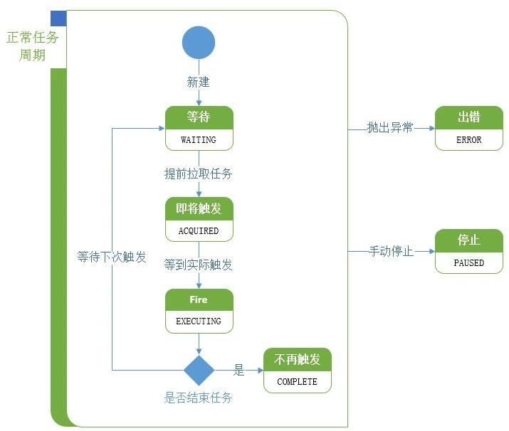

## Demo-Quartz

> 此 demo 主要演示了 Spring Boot 如何集成 Quartz 定时任务，并实现对定时任务的管理，包括新增定时任务，删除定时任务，暂停定时任务，恢复定时任务，修改定时任务启动时间，以及定时任务列表查询。

### Cron

> 0/2 * * * * ?

### 参考

Spring Boot 官方文档

```shell
explorer https://docs.spring.io/spring-boot/docs/2.1.0.RELEASE/reference/htmlsingle/#boot-features-quartz
```

Quartz 官方文档

```shell
explorer http://www.quartz-scheduler.org/documentation/quartz-2.2.x/quick-start.html
```

Quartz 重复调度问题

```shell
explorer https://segmentfault.com/a/1190000015492260
# 关于Quartz定时任务状态 (在 `QRTZ_TRIGGERS` 表中的 `TRIGGER_STATE` 字段)
```



Vue.js 官方文档

```shell
explorer https://cn.vuejs.org/v2/guide/
```

Element-UI 官方文档

```shell
explorer http://element-cn.eleme.io/#/zh-CN
```