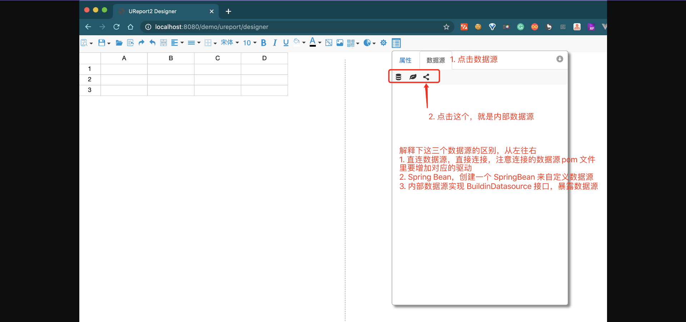
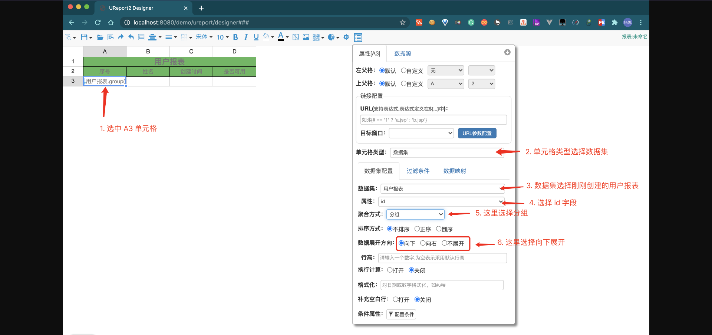
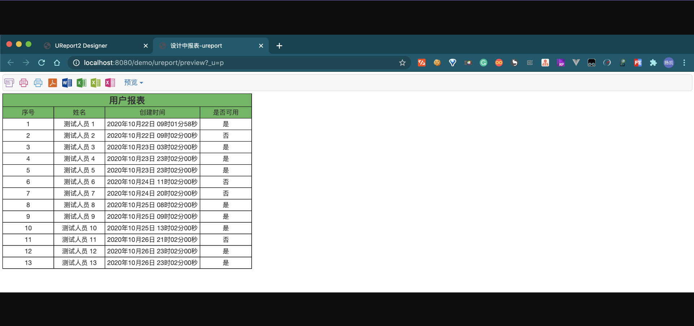
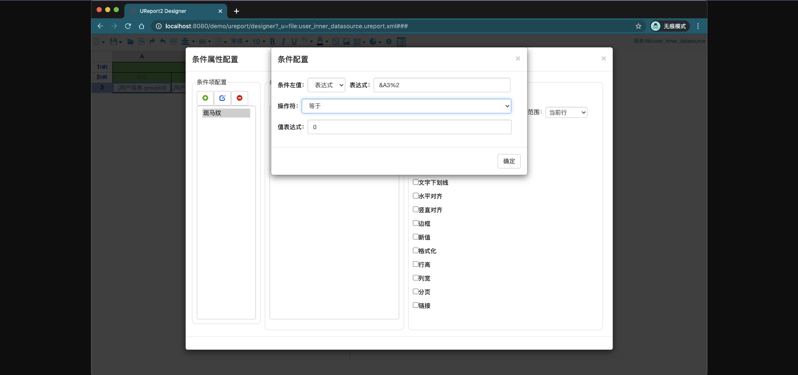

## Demo-Ureport2

> 主要演示了 Spring Boot 项目如何快速集成 ureport2 实现任意复杂的中国式报表功能

> UReport2 是一款基于架构在 Spring 之上纯 Java 的高性能报表引擎，通过迭代单元格可以实现任意复杂的中国式报表。 在
> UReport2中，提供了全新的基于网页的报表设计器，可以在 Chrome、Firefox、Edge 等各种主流浏览器运行（IE
> 浏览器除外）。使用UReport2，打开浏览器即可完成各种复杂报表的设计制作。

---

### 报表设计器

```shell
explorer http://localhost:8080/ureport/designer
```


### 开始设计

#### 选择数据源

这里就需要使用创建的内部数据源



选择数据源


此时列表里就会出现数据源


#### 选择数据集

在刚才选中的数据源右键，选择添加数据集


这里选择上面步骤中初始化的用户表


```sql
${
    if(param("status")==null||param("status")==''){
    	return "select * from t_user_ureport2"
    }else{
    	return "select * from t_user_ureport2 where status = :status"
    }
}
```

预览数据看一下


点击确定，保存数据集


#### 报表设计

创建报表表头的位置


表头内容


操作完成之后，长这样~


然后设置数据的标题行，跟表头设置一样，效果如下图


接下来设置数据



其他字段同理，完成之后如下


此时你可以尝试预览一下数据了


关掉，稍微美化一下


此时数据虽然正常显示了，但是「是否可用」这一列显示0/1 是否可以支持自定义呢？


再次预览一下


顺带再把创建时间的数据格式也改一下


修改后，预览数据如下



#### 保存报表设计文件


点击保存之后，你本地在 `application.yml` 文件中配置的地址就会出现一个 `demo.ureport.xml` 文件

```shell 
# 下次可以直接通过这个地址预览报表了
explorer http://localhost:8080/ureport/preview?_u=file:demo.ureport.xml
```

#### 增加报表查询条件

还记得我们上面新增数据集的时候，加的条件吗？现在用起来


查询表单设计


配置查询参数


美化按钮


在预览一下~


### 集群使用

如上文设计好的模板是保存在服务本机的，在集群环境中需要使用统一的文件系统存储。

```xml
<dependency>
	<groupId>com.pig4cloud.plugin</groupId>
	<artifactId>oss-spring-boot-starter</artifactId>
	<version>0.0.3</version>
</dependency>
```

仅需配置云存储相关参数, 演示为minio

```yaml
oss:
  access-key: lengleng
  secret-key: lengleng
  bucket-name: lengleng
  endpoint: http://minio.pig4cloud.com
```

> 注意：这里使用的是冷冷提供的公共 minio，请勿乱用，也不保证数据的可靠性，建议小伙伴自建一个minio，或者使用阿里云 oss

---

### 踩坑

Ureport2 最新版本是 `2.2.9`，挺久没更新了，存在一个坑：在报表设计页打开一个已存在的报表设计文件时，可能会出现无法预览的情况

参考 ISSUE

```shell
explorer https://github.com/youseries/ureport/issues/393
```


解决办法：


条件表达式变成 `undefined`，这里需要注意的是，我们的 xml 文件是正常的，只不过是 ureport 解析的时候出错了。


点击编辑，重新选择表达式即可解决



再次尝试预览


> 注意：该可能性出现在报表设计文件中使用了条件属性的情况下，修复方法就是打开文件之后，重新配置条件属性，此处是坑，小伙伴使用时注意下就好，最好的方法就是避免使用条件属性

---

### 参考

ureport2 使用文档

```shell
explorer https://www.w3cschool.cn/ureport
```

ureport-spring-boot-starter

```shell
# UReport2 的 spring boot 封装
explorer https://github.com/pig-mesh/ureport-spring-boot-starter
```

oss-spring-boot-starter

```shell
# 兼容所有 S3 协议的分布式文件存储系统
explorer https://github.com/pig-mesh/oss-spring-boot-starter
```